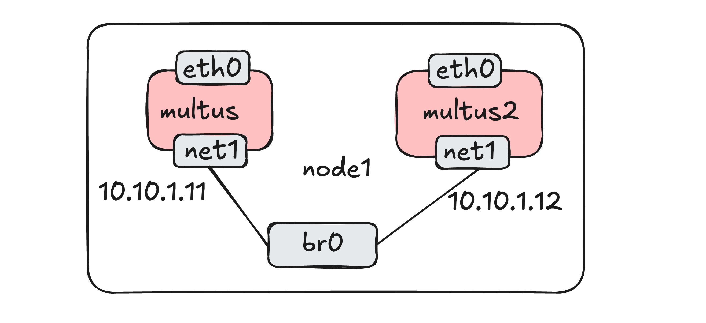

# Lab 2: Advanced Kubernetes Networking with Multus and OVS-CNI
In this lab, you will learn how to enhance Kubernetes pod networking using Multus to add secondary network interfaces and Open Virtual Switch CNI (OVS-CNI) to manage virtual network connections. This setup is used in our 5G core network architectures to support traffic isolation for different interfaces between pods.

**Estimated Time**: 15m

### About OVS 
Open Virtual Switch (OVS) is a software switch designed to work within virtualized environments and provide network connectivity between virtual machines, containers, or physical devices. OVS is popular in Software-Defined Networking (SDN) setups, where it enables flexible network configurations by separating the data plane (packet forwarding) from the control plane (network policies and routing).

For 5G networks, SDN controllers like ONOS can be used to orchestrate and manage network slices in real-time, enabling the creation of isolated paths with specific Quality of Service (QoS) requirements for each slice.

By integrating OVS within Kubernetes and other containerized environments, OVS-CNI can facilitate multi-interface pods and complex networking architectures.

## 0. Prerequisites
Ensure that Multus and OVS-CNI are installed and configured in your Kubernetes cluster. Verify by running:
```bash
kubectl get pods -A | grep -E 'multus|ovs'

cluster-network-addons   ovs-cni-amd64-5gjpg                                1/1     Running   0          97m
kube-system              kube-multus-ds-pt78j                               1/1     Running   0          98m
```
You should see Multus and OVS pods and they should be in `Running` state.

## 1. Creating OVS  Bridges
For this lab, we’ll keep things simple and use only one bridge to understand the fundamentals of adding secondary interfaces to pods using OVS-CNI.

Create an OVS bridge (br0) on your host.
```
sudo ovs-vsctl add-br br0
```
You can check if the bridge has been created using:
```bash
sudo ovs-vsctl show
```

**Note**: If you have used the testbed-automator script, you will also see three other bridges - n2br, n3br and n4br, which will be used later when we deploy our 5G core network.

## 2. Create Network Attachment Definitions (NAD) with Multus
Network Attachment Definitions (NADs) allow you to add secondary network interfaces to Kubernetes pods using Multus. Here, we will define a NAD to add an additional network interface to an Ubuntu pod.


### 2a: Create a simple NAD
To define an additional network for the pods, we will use `secondary-network.yaml` which will associate our secondary interface with the OVS bridge we just created.

```yaml
apiVersion: k8s.cni.cncf.io/v1
kind: NetworkAttachmentDefinition
metadata:
  name: secondary-network
  namespace: workshop
spec:
  config: '{
    "cniVersion": "0.3.1",
    "type": "ovs",
    "bridge": "br0",
    "ipam": {
      "type": "static"
    }
  }'
```

Apply the NAD
```bash
kubectl apply -f secondary-network.yaml
```
You can verify whether they have been deployed using:
```
kubectl get network-attachment-definitions -n workshop
```
### 2b: Deploy an Ubuntu Pod with a Secondary Interface

To attach this secondary network to a pod, look at the following YAML file named `ubuntu-multus-pod.yaml`:

```yaml
apiVersion: v1
kind: Pod
metadata:
  name: ubuntu-multus
  annotations:
    k8s.v1.cni.cncf.io/networks: '[ { "name": "secondary-network", "ips": [ "10.10.1.11/24" ]  } ]'
  namespace: workshop
spec:
  containers:
  - name: ubuntu
    image: ghcr.io/niloysh/toolbox:v1.0.0
    command:
      - "/bin/sh"
      - "-c"
      - "sleep 604800"  # Keep the pod running for a week
    imagePullPolicy: IfNotPresent
```

Deploy the pod as follows:

```bash
kubectl apply -f ubuntu-multus-pod.yaml
```
Verify that the pod is deployed and running as follows:

```
kubectl get pods -n workshop
```

### 2c: Verify the Secondary Interface
Once the pod is running, verify the secondary interface
```bash
kubectl exec -it -n workshop ubuntu-multus -- ip addr
```
You should see an additional interface `net1` besides the default `eth0`, with an IP address `10.10.1.11` as specified in `secondary-network.yaml`.

## 3. Testing Connectivity between Pods

### 3a: Deploy a second Ubuntu Pod
Let's create another pod with a similar configuration, but different IP addresses. Look athe the `ubuntu-multus-pod2.yaml` file. Here the `metadata -> annotations -> k8s.v1.cni.cncf.io/networks -> ips` has been changed to `10.10.1.12`:


```yaml
apiVersion: v1
kind: Pod
metadata:
  name: ubuntu-multus2
  annotations:
    k8s.v1.cni.cncf.io/networks: '[ { "name": "secondary-network", "ips": ["10.10.1.12/24"] } ]'
  namespace: workshop
spec:
  containers:
  - name: ubuntu
    image: ghcr.io/niloysh/toolbox:v1.0.0
    command:
      - "/bin/sh"
      - "-c"
      - "sleep 604800"  # Keep the pod running for a week
    imagePullPolicy: IfNotPresent
```
Apply the configuration
```bash
kubectl apply -f ubuntu-multus-pod2.yaml

```
Ensure the pod is up and running with:

```
kubectl get pods -n workshop
```

### 3b: Verify connectivity



Ping the IP of `ubuntu-multus2`'s secondary interface from the first multus pod:
```bash
kubectl exec -it ubuntu-multus -n workshop -- ping 10.10.1.12 -c 4
```

Congratulations! You have successfully configured multi-interface networking in Kubernetes using OVS-CNI. Now you are ready to deploy the 5G network!

