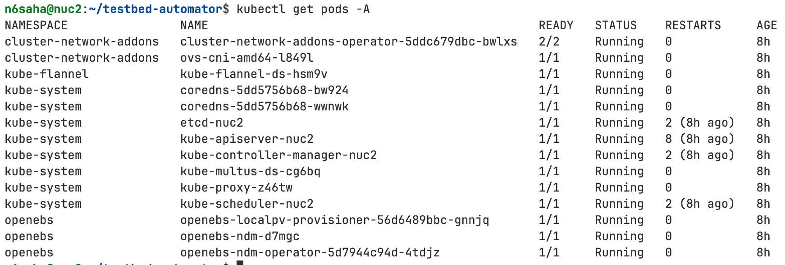

# Testbed Automator Script Overview
**Purpose**: Automates the setup and configuration of a testbed environment.

**Key Tasks**
- Install necessary software packages
- Set up Kubernetes and networking tools
- Configure various networking plugins like Flannel, Multus, OpenVSwitch (OVS)
- Install storage management systems (OpenEBS)

---
# Technologies and Tools
**Kubernetes**
- Kubeadm: Initializes the Kubernetes cluster.
- kubectl: CLI tool to interact with the Kubernetes cluster.
- Helm: Package manager for Kubernetes applications.

**Networking**
- Flannel: Container Network Interface (CNI) for Kubernetes.
- Multus: Meta-CNI for multi-network interfaces.
- OpenVSwitch (OVS): Used for advanced networking and bridge management.
	
---
# Technologies and Tools (Cont.)
**Containerization**
- Containerd: CRI-compatible container runtime. 

    A container runtime builds on top of operating system kernel features and improves container management with an abstraction layer, which manages namespaces, cgroups, union file systems, networking capabilities, etc.

**Storage**
- OpenEBS: Manages the storage available on each of the Kubernetes nodes and uses that storage to provide Local or Replicated Persistent Volumes to Stateful workloads.
---
# Deploying `testbed-automator`

You can use the `install.sh` script as follows:
```bash
git clone https://github.com/niloysh/testbed-automator
cd testbed-automator
./install.sh
```


**Note**: Do NOT run the `install.sh` script as `sudo` or `root.` Run it as a regular user and provide the password when prompted.

---
# Verify Deployment

On completion, run `kubectl get pods -A` you should see:



After confirming deployment, proceed with [Lab 1](https://niloysh.github.io/testbed-automator/labs/lab1/README.md) to deepen your understanding of the tools you've just deployed.


